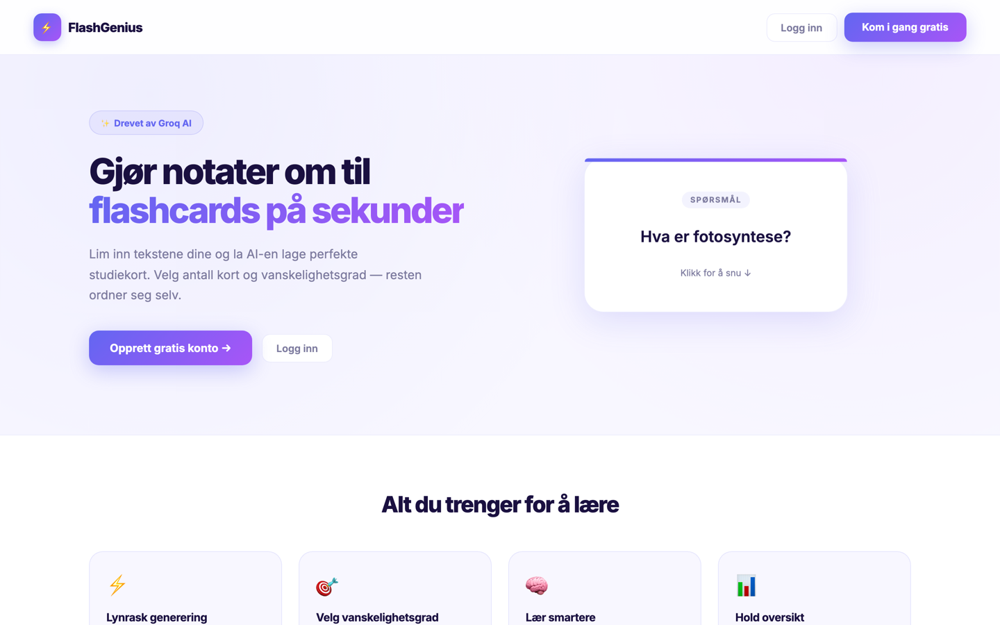
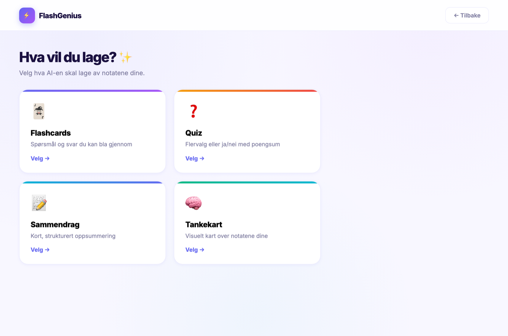
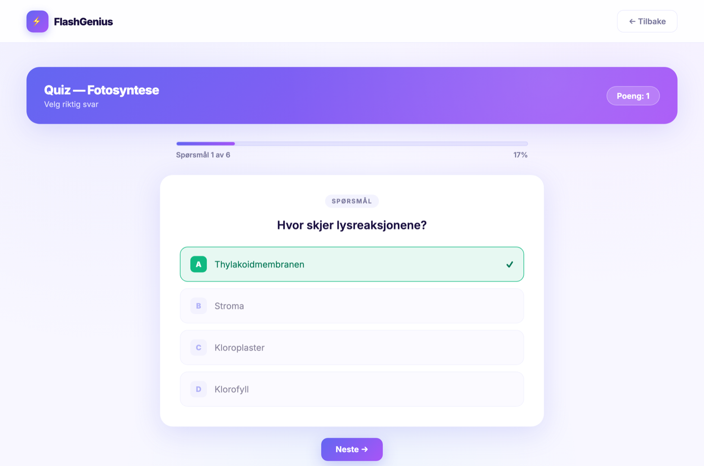
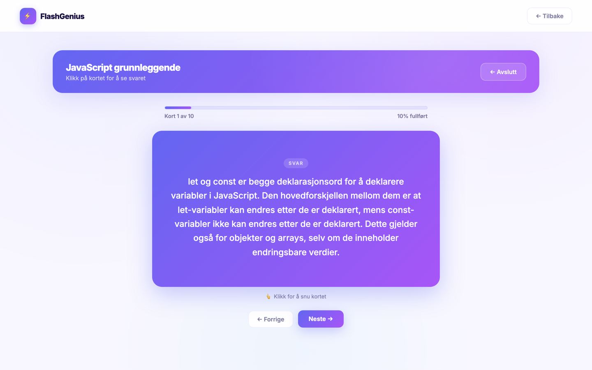
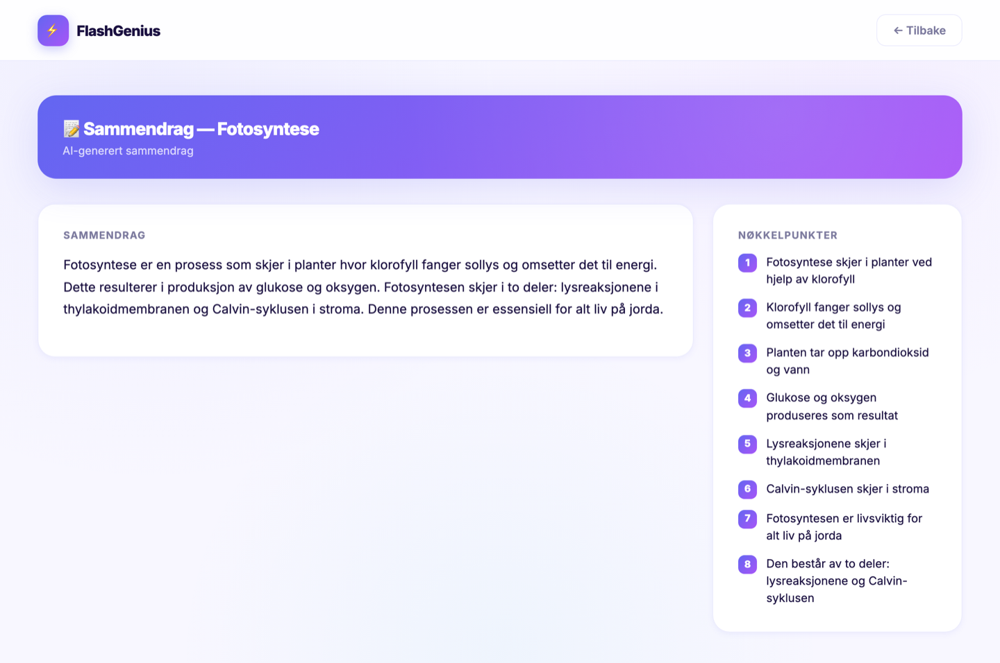
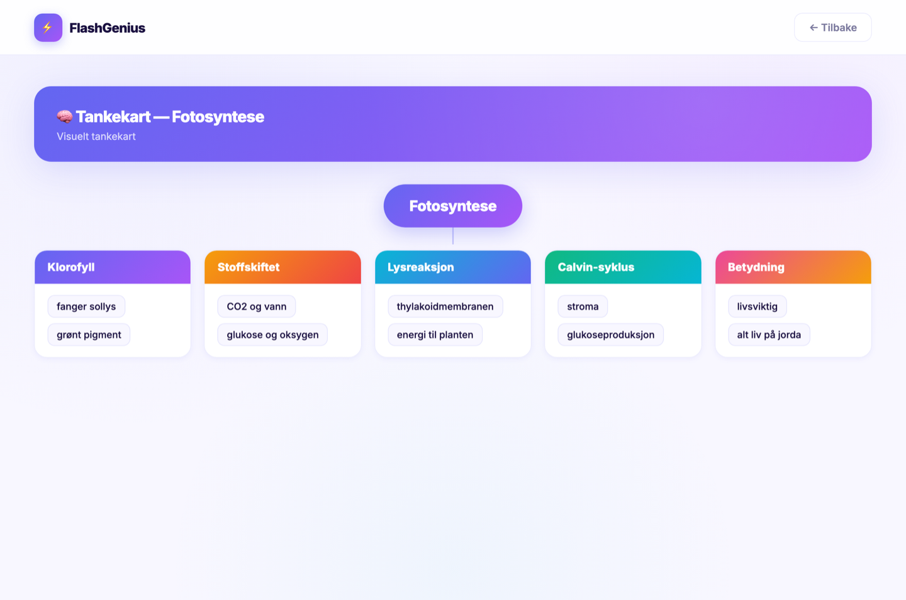
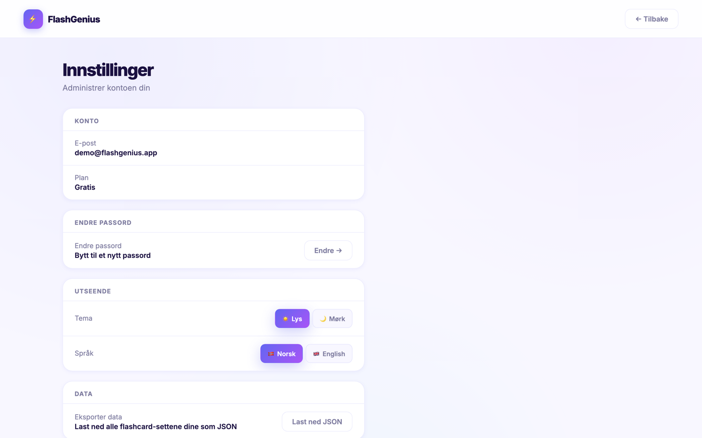
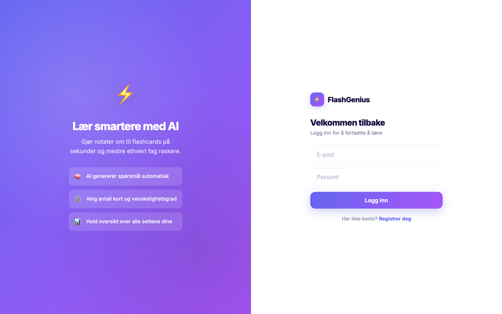

<div align="center">

# ⚡ FlashGenius

### Turn your notes into AI-generated study material in seconds

Paste any text and let AI build **flashcards, quizzes, summaries, or mind maps** — then study them with clean, interactive interfaces.

<br/>

### 🔗 [**Try the live demo →**](https://flash-genius-vvo5.vercel.app)

<sub>Hosted on Vercel (frontend + serverless backend) with a Neon PostgreSQL database. The backend may take a few seconds to wake up on the first request.</sub>

<sub>💳 **Try the paid plans for free:** payments run in Stripe test mode — use card number `4242 4242 4242 4242`, any future expiry date, and any CVC to unlock Plus/Pro/Ultra without spending a krone.</sub>

<br/>

[](https://github.com/arink1305/FlashGenius/actions/workflows/ci.yml)


<br/>



</div>

<br/>

## ✨ Features

**Four AI generation modes** — pick what to create from your notes:

- 🃏 **Flashcards** — Q&A cards with configurable count (5–20) and difficulty (easy / medium / hard), studied with a card-flip interface
- ❓ **Quizzes** — multiple-choice (4 options) or yes/no questions, answered interactively with instant feedback and a score
- 📝 **Summaries** — a structured summary plus a list of key points
- 🧠 **Mind maps** — an interactive, zoomable tree with collapsible branches, branch highlighting, and click-to-expand nodes

**Monetization** — a real freemium model backed by Stripe Checkout:

| Plan | Price | Unlocks |
|------|-------|---------|
| **Free** | 0 kr | 5 sets, flashcards / quizzes / summaries |
| **Plus** | 49 kr | Unlimited sets, mind maps, PDF upload, export, folders |
| **Pro** | 99 kr | Smart review (SM-2 spaced repetition), statistics & streaks, stronger AI model |
| **Ultra** | 149 kr | Shareable set links, API access, priority generation |

One-time payments with upgrade credit — existing customers only pay the difference (verified server-side). Quotas and feature gates are enforced in the backend, not just hidden in the UI.

Plus everything around it:

-  **Powered by Llama 3.x** via the Groq API, with robust JSON parsing (retry + salvage) so generations don't fail — Pro/Ultra requests use the larger 70B model
-  **Smart review** — an SM-2 spaced-repetition engine schedules each card exactly when you're about to forget it
-  **Statistics** — day streaks, a weekly review chart, and per-deck mastery tracking
-  **Folders** — organize your sets into color-coded animated folders
-  **File upload** — extract notes straight from PDF, TXT, or MD files in the browser
-  **Set sharing** — Ultra users can publish read-only links to any set
-  **Accounts & authentication** — JWT-based auth with bcrypt-hashed passwords, plus API-key auth for Ultra
-  **Light & dark mode** — switch themes instantly, preference is remembered
-  **Bilingual UI** — toggle between Norwegian and English
-  **Polished motion design** — page transitions, staggered cards, skeleton loaders, and drifting background blobs (framer-motion + CSS)
-  **Account management** — change password, export data, or delete your account
-  **Public landing page** — browse the app and pricing before signing up

<br/>

##  Screenshots

<table>
  <tr>
    <td width="50%">
      <strong>Choose what to generate</strong><br/>
      
    </td>
    <td width="50%">
      <strong>Dashboard</strong><br/>
      
    </td>
  </tr>
  <tr>
    <td width="50%">
      <strong>Quiz mode</strong><br/>
      
    </td>
    <td width="50%">
      <strong>Flashcard study mode</strong><br/>
      
    </td>
  </tr>
  <tr>
    <td width="50%">
      <strong>AI summary</strong><br/>
      
    </td>
    <td width="50%">
      <strong>Mind map</strong><br/>
      
    </td>
  </tr>
  <tr>
    <td width="50%">
      <strong>Settings</strong><br/>
      
    </td>
    <td width="50%">
      <strong>Login</strong><br/>
      
    </td>
  </tr>
</table>

<br/>

##  How it works

```
┌─────────────┐      ┌──────────────┐      ┌─────────────┐      ┌──────────────┐
│   React +   │ HTTP │   FastAPI    │  SQL │ PostgreSQL  │      │   Groq API   │
│    Vite     │─────▶│   backend    │─────▶│  database   │      │  (Llama 3.1) │
│  (frontend) │◀─────│              │◀─────│             │      │              │
└─────────────┘ JSON └──────┬───────┘ rows └─────────────┘      └──────▲───────┘
                            │                                          │
                            └──────────── prompt + notes ──────────────┘
                                          flashcards (JSON)
```

1. **You paste notes** on the Generate page and choose a card count and difficulty.
2. The **frontend** sends the request to the FastAPI backend with your JWT token in the `Authorization` header.
3. The **backend** builds a prompt and asks **Groq (Llama 3.1)** to return a strict JSON array of `{ question, answer }` objects.
4. The cards are **saved to PostgreSQL** under a new deck linked to your user, and the deck is returned to the frontend.
5. You're taken straight into **study mode** to review them.

<br/>

##  Tech stack

| Layer | Technology |
|-------|------------|
| **Frontend** | React 19, Vite, React Router, Axios, framer-motion, lucide-react, plain CSS (custom properties, glass morphism, animations) |
| **Backend** | FastAPI, Uvicorn |
| **Database** | PostgreSQL (via `psycopg2`) |
| **Auth** | JWT (`python-jose`), password hashing with `bcrypt`, API keys for Ultra |
| **Payments** | Stripe Checkout (one-time payments, tier metadata, server-side verification) |
| **AI** | Groq API — `llama-3.1-8b-instant` (Free/Plus) and `llama-3.3-70b-versatile` (Pro/Ultra) |

<br/>

##  Running locally

The app is **live above** — but you can also clone and run it yourself.

<details>
<summary><strong>Click to expand local setup instructions</strong></summary>

<br/>

### Prerequisites

- Node.js 18+
- Python 3.11+
- PostgreSQL
- A free [Groq API key](https://console.groq.com/keys)

### 1. Clone the repo

```bash
git clone https://github.com/arink1305/FlashGenius.git
cd FlashGenius
```

### 2. Set up the database

```bash
createdb flashgenius
```

### 3. Backend

```bash
cd backend
python3 -m venv venv
source venv/bin/activate
pip install -r requirements.txt
```

Create a `backend/.env` file:

```env
GROQ_API_KEY=your_groq_api_key_here
DATABASE_URL=postgresql://localhost/flashgenius
SECRET_KEY=a_long_random_secret_string
```

Start the API:

```bash
uvicorn main:app --reload
```

The backend runs on **http://localhost:8000**.

### 4. Frontend

```bash
cd frontend
npm install
npm run dev
```

The app runs on **http://localhost:5173**.

</details>

<br/>

## 🧪 Tests, CI & Docker

**Tests** — backend logic (auth hashing, JWT, AI-response parsing & mind-map normalization) and frontend utilities/hooks are covered by unit tests:

```bash
cd backend && pytest          # backend (pytest)
cd frontend && npm test       # frontend (Vitest)
```

**CI** — every push and pull request runs the full test suite and a production build via [GitHub Actions](.github/workflows/ci.yml).

**Docker** — run the whole stack (frontend + backend + PostgreSQL) with one command:

```bash
GROQ_API_KEY=your_key docker compose up --build
```

<br/>

## 📁 Project structure

```
FlashGenius/
├── backend/
│   ├── main.py              # FastAPI app + CORS + routers
│   ├── database.py          # DB connection & table setup
│   ├── requirements.txt
│   └── routers/
│       ├── auth.py          # register, login, /me, API keys, account
│       ├── billing.py       # Stripe checkout + payment confirmation
│       └── flashcards.py    # generation, decks, folders, reviews, stats, sharing
│
└── frontend/
    └── src/
        ├── api.js           # Axios instance with JWT interceptor
        ├── useMe.js         # cached account/tier hook + tier gating helpers
        ├── App.jsx          # Routes + auth guards + page transitions
        ├── components/      # Topbar, Footer, Folder, ShareButton, skeletons
        └── pages/
            ├── Landing.jsx        # public marketing page
            ├── Pricing.jsx        # plan comparison + Stripe checkout
            ├── Dashboard.jsx      # sets, folders, stats strip
            ├── Generate.jsx       # notes input + count/difficulty + file upload
            ├── Study.jsx          # card-flip study mode
            ├── SmartStudy.jsx     # SM-2 spaced repetition
            ├── Stats.jsx          # streaks, weekly chart, mastery
            ├── Mindmap.jsx        # interactive zoomable mind map
            ├── SharedDeck.jsx     # public read-only shared sets
            └── Settings.jsx       # plan, theme, language, data, account
```

<br/>

## 💡 What I built

This is a full-stack project I built end to end:

- Designed and built the **entire frontend** in React — a public landing page, auth flow, dashboard with animated folders, an AI generation page with live settings, card-flip study and SM-2 review modes, a statistics page, an interactive mind map with zoom/pan, and a pricing page.
- Built the **REST API** in FastAPI from scratch, including JWT authentication, bcrypt password hashing, tier-based feature gating, and full CRUD for decks, folders, and reviews.
- Integrated **Stripe Checkout** end to end — one-time payments per tier, upgrade pricing where existing customers pay only the difference, and server-side payment verification before any account is upgraded.
- Designed a **relational schema** in PostgreSQL (users → folders → decks → flashcards → card progress + review log) and wrote the queries by hand.
- Implemented the **SM-2 spaced-repetition algorithm** on the backend to schedule card reviews, feeding the streak and mastery statistics.
- Integrated a **large language model** (Llama 3.x through Groq) and engineered the prompt so the model returns strict, parseable JSON every time.
- Did all the **UI/UX and styling** myself in plain CSS + framer-motion — the light/dark themes, gradients, glass morphism, page transitions, and micro-animations.

## 🎓 What I learned

- **Connecting a frontend, backend, database, and an external AI API** into one working product — and how the pieces talk to each other over HTTP and SQL.
- **Authentication done properly** — how JWTs flow from login through to protected endpoints, and why passwords must be hashed (I hit and fixed a real bcrypt edge case along the way).
- **Prompt engineering for reliability** — getting an LLM to consistently return machine-readable JSON took a strict system prompt and a low temperature, not just asking nicely.
- **Working with constraints** — I started on one AI provider, hit free-tier limits, and migrated the whole integration to Groq, which taught me to keep that layer swappable.
- **Shipping a complete, polished experience** rather than a demo — empty states, loading states, error handling, responsive layouts, and the small details that make an app feel finished.

<br/>

<div align="center">

Built by **Arin Kehreman** · [GitHub](https://github.com/arink1305)

</div>
