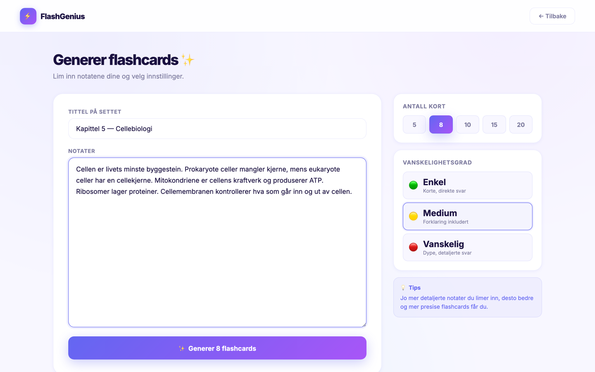
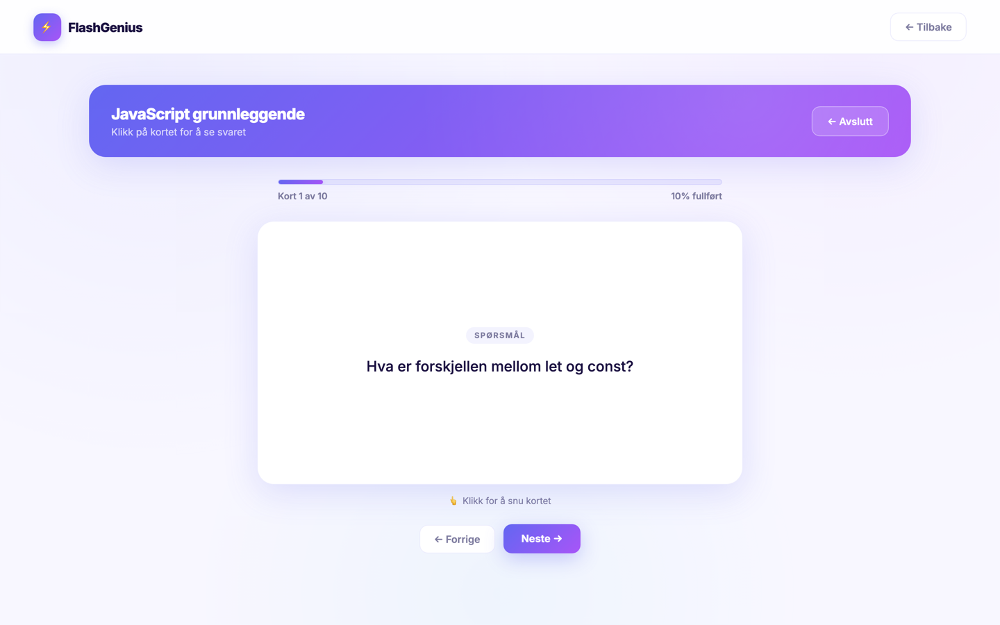

<div align="center">

# ⚡ FlashGenius

### Turn your notes into AI-generated flashcards in seconds

Paste any text, pick how many cards and how hard you want them, and let AI build a study set you can review with a clean card-flip interface.

<br/>

### 🔗 [**Try the live demo →**](https://flash-genius-vvo5.vercel.app)

<sub>Hosted on Vercel (frontend + serverless backend) with a Neon PostgreSQL database. The backend may take a few seconds to wake up on the first request.</sub>

<br/>


<br/>


</div>

<br/>

## ✨ Features

- 🤖 **AI-powered generation** — paste notes and get well-formed Q&A flashcards back in seconds, powered by Llama 3.1 via the Groq API
- 🎚️ **Configurable output** — choose how many cards (5–20) and the difficulty (easy / medium / hard)
- 🔐 **Accounts & authentication** — register and log in with JWT-based auth and bcrypt-hashed passwords
- 📚 **Personal library** — every set is saved to your account and shown on a clean dashboard
- 🃏 **Study mode** — flip cards, track progress with a live progress bar, and get a completion screen when you're done
- 🌗 **Light & dark mode** — switch themes instantly, preference is remembered
- 🌍 **Bilingual UI** — toggle between Norwegian and English
- 📤 **Export your data** — download all your sets as JSON
- ⚙️ **Account management** — change password, export data, or delete your account
- 🏠 **Public landing page** — browse the app before signing up; an account is only required to generate cards

<br/>

## 📸 Screenshots

<table>
  <tr>
    <td width="50%">
      <strong>Dashboard</strong><br/>
      
    </td>
    <td width="50%">
      <strong>Generate flashcards</strong><br/>
      
    </td>
  </tr>
  <tr>
    <td width="50%">
      <strong>Study mode</strong><br/>
      
    </td>
    <td width="50%">
      <strong>Card flipped to the answer</strong><br/>
      
    </td>
  </tr>
  <tr>
    <td width="50%">
      <strong>Settings</strong><br/>
      
    </td>
    <td width="50%">
      <strong>Login</strong><br/>
      
    </td>
  </tr>
</table>

<br/>

## 🧠 How it works

```
┌─────────────┐      ┌──────────────┐      ┌─────────────┐      ┌──────────────┐
│   React +   │ HTTP │   FastAPI    │  SQL │ PostgreSQL  │      │   Groq API   │
│    Vite     │─────▶│   backend    │─────▶│  database   │      │  (Llama 3.1) │
│  (frontend) │◀─────│              │◀─────│             │      │              │
└─────────────┘ JSON └──────┬───────┘ rows └─────────────┘      └──────▲───────┘
                            │                                          │
                            └──────────── prompt + notes ──────────────┘
                                          flashcards (JSON)
```

1. **You paste notes** on the Generate page and choose a card count and difficulty.
2. The **frontend** sends the request to the FastAPI backend with your JWT token in the `Authorization` header.
3. The **backend** builds a prompt and asks **Groq (Llama 3.1)** to return a strict JSON array of `{ question, answer }` objects.
4. The cards are **saved to PostgreSQL** under a new deck linked to your user, and the deck is returned to the frontend.
5. You're taken straight into **study mode** to review them.

<br/>

## 🛠️ Tech stack

| Layer | Technology |
|-------|------------|
| **Frontend** | React 19, Vite, React Router, Axios, plain CSS (custom properties, glass morphism, animations) |
| **Backend** | FastAPI, Uvicorn |
| **Database** | PostgreSQL (via `psycopg2`) |
| **Auth** | JWT (`python-jose`), password hashing with `bcrypt` |
| **AI** | Groq API — `llama-3.1-8b-instant` |

<br/>

## 🚀 Getting started

### Prerequisites

- Node.js 18+
- Python 3.11+
- PostgreSQL
- A free [Groq API key](https://console.groq.com/keys)

### 1. Clone the repo

```bash
git clone https://github.com/arink1305/FlashGenius.git
cd FlashGenius
```

### 2. Set up the database

```bash
createdb flashgenius
```

### 3. Backend

```bash
cd backend
python3 -m venv venv
source venv/bin/activate
pip install -r requirements.txt
```

Create a `backend/.env` file:

```env
GROQ_API_KEY=your_groq_api_key_here
DATABASE_URL=postgresql://localhost/flashgenius
SECRET_KEY=a_long_random_secret_string
```

Start the API:

```bash
uvicorn main:app --reload
```

The backend runs on **http://localhost:8000**.

### 4. Frontend

```bash
cd frontend
npm install
npm run dev
```

The app runs on **http://localhost:5173**.

<br/>

## 📁 Project structure

```
FlashGenius/
├── backend/
│   ├── main.py              # FastAPI app + CORS + routers
│   ├── database.py          # DB connection & table setup
│   ├── requirements.txt
│   └── routers/
│       ├── auth.py          # register, login, change password, delete account
│       └── flashcards.py    # generate, list, fetch, export, delete decks
│
└── frontend/
    └── src/
        ├── api.js           # Axios instance with JWT interceptor
        ├── App.jsx          # Routes + auth guards
        └── pages/
            ├── Landing.jsx        # public marketing page
            ├── Login.jsx
            ├── Register.jsx
            ├── Dashboard.jsx      # your saved sets + profile menu
            ├── Generate.jsx       # notes input + count/difficulty
            ├── Study.jsx          # card-flip study mode
            ├── Settings.jsx       # theme, language, data, account
            └── ChangePassword.jsx
```

<br/>

## 💡 What I built

This is a full-stack project I built end to end:

- Designed and built the **entire frontend** in React — a public landing page, auth flow, dashboard, an AI generation page with live settings, an animated card-flip study mode, and a settings page with theme switching, language toggle, data export, and account management.
- Built the **REST API** in FastAPI from scratch, including JWT authentication, bcrypt password hashing, and full CRUD for flashcard decks.
- Designed a **relational schema** in PostgreSQL (users → decks → flashcards) and wrote the queries by hand.
- Integrated a **large language model** (Llama 3.1 through Groq) and engineered the prompt so the model returns strict, parseable JSON every time.
- Did all the **UI/UX and styling** myself in plain CSS — the light/dark themes, gradients, glass morphism, and animations.

## 🎓 What I learned

- **Connecting a frontend, backend, database, and an external AI API** into one working product — and how the pieces talk to each other over HTTP and SQL.
- **Authentication done properly** — how JWTs flow from login through to protected endpoints, and why passwords must be hashed (I hit and fixed a real bcrypt edge case along the way).
- **Prompt engineering for reliability** — getting an LLM to consistently return machine-readable JSON took a strict system prompt and a low temperature, not just asking nicely.
- **Working with constraints** — I started on one AI provider, hit free-tier limits, and migrated the whole integration to Groq, which taught me to keep that layer swappable.
- **Shipping a complete, polished experience** rather than a demo — empty states, loading states, error handling, responsive layouts, and the small details that make an app feel finished.

<br/>

<div align="center">

Built by **Arin Kehreman** · [GitHub](https://github.com/arink1305)

</div>
